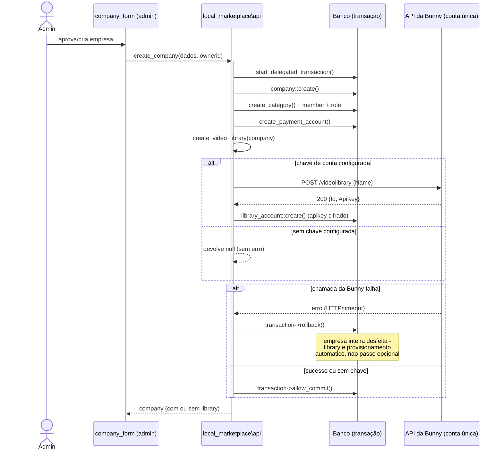

# Bunny multi-tenant (Frente B) + trava de resolução no player (Frente C)

> **Situação:** em andamento — sub-passo 1 concluído e provado ao vivo ·
> **Início:** 2026-09-25
>
> Gate de contradições fechado nesta data — ver
> [`../produto/gate-contradicoes.md`](../produto/gate-contradicoes.md) "Como
> usar este gate", item 3. ADR-0014 promovido a **Aceita**. Ordem aprovada:
> **B+C → A** ([`../produto/plano-implementacao.md`](../produto/plano-implementacao.md)).

## Contexto

O produto vende cursos com vídeo, e a resolução que o aluno assiste precisa
respeitar a mensalidade que a empresa paga à plataforma (ADR-0014) — sem essa
trava, um curso barato consome banda cara e a economia do plano não se sustenta.
`plan::max_resolution_for()` e `local_marketplace_plan_tier` já existem no banco
(seed dos planos Start/PRO) mas **não têm consumidor**: nada no player lê o teto.
O plano Free continua no `mod_ldgvideo` (embed YouTube, banda zero) ou pode optar
por Bunny limitado — decisão de hoje, ambos os modos ficam abertos.

Este documento cobre a implementação de hoje: sub-passo 1 da Frente B+C
(mapeamento `company` ↔ `library`, provisionamento automático) e o desenho para
os sub-passos 2–4 (fork do plugin de referência, hook no player, trava na
origem). A Frente A (BYOS) fica para depois — sem as duas peças do TRD
(storage de chave, roteamento por `hostingmodel`), BYOS não é vendável.

## Decisões de arquitetura tomadas hoje

1. **Uma conta Bunny só, da plataforma.** Vendedores nunca veem Bunny nem
   geram chave própria nesta frente (isso é a Frente A). O upload acontece
   dentro da plataforma; o código escolhe a `library` da empresa por trás.
2. **Provisionamento automático no `create_company`.** Toda empresa aprovada
   já nasce com uma `library` Bunny própria, criada por chamada de API —
   mesmo padrão de `api::create_payment_account()`
   (`public/local/marketplace/classes/api.php:676`), que já cria um recurso
   externo por empresa dentro da mesma transação de criação.
3. **Plugin novo, não extensão do `mod_ldgvideo`.** Confirmado em
   `docs/architecture/estado-e-proximas-fases.md`: "quando [a Fase 5]
   destravar, o plugin de vídeo do plano pago **é outro** — com upload, chave
   de API e link assinado." O `mod_ldgvideo` mantém sua postura de "não
   conhece provider" (`classes/url.php`); introduzir Bunny ali quebraria essa
   fronteira. Nasce `mod_bunnystream`, fork de
   [`amirtds/moodle-mod_bunnystream`](https://github.com/amirtds/moodle-mod_bunnystream).
4. **Trava na origem = reconfigurar o perfil de encoding da `library` via API,
   não o token assinado.** Pesquisa confirmou: o token assinado da Bunny
   (`sha256(security_key + video_id + expires)`) só valida acesso —
   sim/não —, **não restringe resolução**. Resolução é propriedade da
   `library` (perfil de encoding, dashboard/API). Consequência prática: ao
   criar ou atualizar o plano da empresa, o código chama a API da Bunny para
   configurar as resoluções habilitadas daquela `library` de acordo com
   `plan::max_resolution_for()`. Isso também resolve o player "de graça" — se
   o manifesto HLS da origem só contém as trilhas permitidas, o seletor de
   qualidade não tem o que oferecer acima do teto.
5. **Base de código**: fork de `amirtds/moodle-mod_bunnystream`, mas **sem
   reaproveitar o singleton de credenciais** (`bunnystream_config`, uma
   `library_id`/`api_key` só para a instalação inteira). Esse plugin foi
   desenhado single-tenant — a base de multi-tenant é código novo.

## O que muda no schema

Nova tabela `local_marketplace_library`, no padrão de `local_marketplace_account`
(`public/local/marketplace/classes/company_account.php`,
`db/install.xml:89-107`), mas 1:1 (sem dimensão de país):

| Campo | Tipo | Nota |
|---|---|---|
| `id` | int, PK | |
| `companyid` | int, FK `local_marketplace_company`, **unique** | 1 library por empresa |
| `bunnylibraryid` | int | id retornado pela Bunny na criação |
| `apikey` | text, cifrado (`\core\encryption`) | chave da library (não a chave de conta da plataforma) — **único campo que a Bunny devolve na criação**, confirmado ao vivo |
| `securitykey` | text, cifrado, **nullable** | usada para assinar URL/token de embed — nasce nula, ver "Achado ao vivo" abaixo |
| `cdnhostname` | char, **nullable** | `vz-xxxxxxxx-xxx.b-cdn.net` — nasce nulo, ver "Achado ao vivo" abaixo |
| `maxresolution` | char, nullable | último teto aplicado na origem (campo real da Bunny: `EnabledResolutions`) — cache para não rechamar a API sem necessidade |
| `usermodified`, `timecreated`, `timemodified` | padrão persistent | |

### Achado ao vivo (25/09/2026, conta Bunny real)

A suposição inicial — que a criação de library devolveria `PullZoneStreamToken`
e `PullZone`/hostname junto com `Id`/`ApiKey` — **não se confirmou**. Testado
contra a API real (`POST /videolibrary`, e depois `GET /videolibrary/{id}` para
inspecionar o objeto completo):

- A criação devolve **só `Id` e `ApiKey`**. `securitykey` e `cdnhostname`
  nascem `NULL` no schema (campos tornados nullable depois deste achado).
- O hostname de entrega não é campo da library: ela só expõe `PullZoneId`
  (um id numérico de outro recurso, a Pull Zone), que exige uma chamada
  separada (`GET /pullzone/{id}`) para virar hostname de verdade.
- A chave de assinatura de token (`securitykey`) também não existe até
  `PlayerTokenAuthenticationEnabled` ser ligado na library — outra chamada.
- **Achado que valida a decisão 4**: a library real tem
  `EnabledResolutions: "240p,360p,480p,720p,1080p"` — confirma que o teto de
  resolução é mesmo uma propriedade da library, editável por API, exatamente
  como a decisão 4 previu. É esse o campo que o sub-passo 4 vai escrever.

Os dois recursos de teste criados durante a prova (`bunnylibraryid` 762382 e
762396) foram apagados via `DELETE /videolibrary/{id}` ao final — a conta
Bunny real não ficou com lixo de teste.

A **chave de conta da plataforma** (nível de conta Bunny, usada só para criar
`library` novas) fica em admin setting cifrado do `local_marketplace`
(`admin_setting_encryptedpassword`, mesmo padrão do `security_key` do plugin
de referência) — não em tabela, porque é uma só, da plataforma.

`plan_tier::RESOLUTIONS` já é `['720p', '1080p', '1440p', '4k']` — reaproveitar,
sem inventar enum novo.

## Diagrama — provisionamento automático (sub-passo 1)

## Sub-passos de hoje

### 1. Mapeamento `company` ↔ `library` (schema + provisionamento) — **concluído em 25/09/2026**

- `db/install.xml` + `db/upgrade.php` (versão `2026092500`): tabela
  `local_marketplace_library`, no padrão do upgrade `2026082546` para
  `local_marketplace_account` — `xmldb_table` manual, guarda só em
  `field_exists`/`index_exists`, nunca em `table_exists()` para tabela
  própria. `securitykey`/`cdnhostname` nullable — ver "Achado ao vivo" acima.
- `classes/library_account.php`: persistent no padrão de `company_account`
  (`get_for(int $companyid)`, `encrypt()`/`get_api_key()`/`get_security_key()`
  cifrados via `\core\encryption`, `validate_companyid` recusando segunda
  library da mesma empresa, `validate_maxresolution` contra
  `plan_tier::RESOLUTIONS`).
- `classes/bunny_platform_client.php`: cliente HTTP para a **API de conta**
  da Bunny (`POST /videolibrary`), seam `make_curl()` no mesmo padrão do
  `asaas_client` deste projeto — mockável em teste sem tocar rede.
- Hook em `api::create_company()` (`classes/api.php`): novo passo
  `self::create_video_library($company)` dentro da mesma transação, logo
  depois de `create_payment_account()`. Sem a chave de conta configurada
  (`local_marketplace/bunnyaccountapikey`), devolve `null` e a empresa nasce
  normalmente — provisionamento fica em espera, não é erro. **Com** a chave
  configurada, falha na chamada Bunny propaga e desfaz a empresa inteira
  (mesma transação).
- `api::override_bunny_client()`: seam de teste para trocar o cliente por um
  falso sem mexer em config — usado pelos testes de provisionamento.
- Settings: `admin_setting_encryptedpassword` em `local_marketplace/settings.php`
  para a chave de conta da plataforma.
- Testes (13 novos, todos verdes — 178 no total do plugin, baseline 165):
  `bunny_platform_client_test.php` (criação, resposta sem Id, erro HTTP, erro
  de transporte), `library_account_test.php` (roundtrip cifrado, unicidade por
  empresa, resolução inválida recusada, nulos tratados), `video_library_provisioning_test.php`
  (empresa sem Bunny configurada nasce sem library; empresa com Bunny
  configurada nasce com library; segunda chamada não bate na API de novo;
  falha da Bunny desfaz a empresa). `db_schema_test.php` ganhou
  `library_account` na lista de persistents com coluna conferida.
- **Provado ao vivo contra a conta Bunny real do usuário** (não só mock):
  `api::create_company()` criou e vinculou uma library de verdade duas vezes
  (`bunnylibraryid` 762382 e 762396), com `apikey` cifrado no banco e
  decifrando de volta certo. Os dois recursos de teste foram apagados da
  conta Bunny ao final. `phpcs --standard=moodle-extra` limpo (0/0) em todos
  os arquivos novos/alterados; `check_database_schema.php` confirma
  `install.xml` batendo com o banco migrado.

### 2. Integrar o fork `amirtds/moodle-mod_bunnystream` — **concluído em 25/09/2026**

Nasceu `mod_bunnystream` completo (fork integral, não um recorte): upload TUS,
autoria inline de 5 painéis, legendas, capítulos, transcrição automática,
miniatura customizada, progresso/conclusão/nota, privacidade, backup/restore,
app mobile — tudo portado. A mudança estrutural, em relação ao plugin de
referência:

- **Sem singleton `bunnystream_config`.** `classes/config.php` resolve a
  credencial por **curso**: `config::for_course($courseid)` →
  `local_marketplace\company::for_course()` →
  `local_marketplace\library_account::get_for()`. Dois cursos de empresas
  diferentes nunca compartilham `api_key`/`library_id` — provado em teste
  (`config_test.php::test_two_companies_never_share_credentials`).
- **Todo endpoint AJAX (12 arquivos) carrega `courseid`** — na criação do
  video (`upload_token.php`) ainda não há `guid`, então o curso é a única
  pista de qual empresa/library usar; os demais endpoints usam o mesmo
  parâmetro por uniformidade. `ajax_helper::require_manage()`/`require_view()`
  centralizam login + capability (`mod/bunnystream:addinstance`, contexto do
  **curso**, não mais checagem heurística de sistema) + resolução da credencial.
- **Webhook por library, não por instalação.** `local_marketplace_library`
  ganhou `webhooksecret` (gerado sozinho em `before_create()`, único por
  library) — o token na URL do webhook (`/mod/bunnystream/webhook.php?token=`)
  é como o processor sabe de qual empresa veio o POST da Bunny, com as
  mesmas três guardas do plugin de referência (segredo, `VideoLibraryId`,
  regressão de estado terminal) mais uma quarta (`tenant_mismatch`) que só
  existe porque agora há mais de uma library — coberta em teste.
- **`settings.php` sem campo de credencial.** Não há mais "cole a library ID
  e a API key aqui": só o padrão de `completion_percent`. A credencial nasce
  sozinha no `create_company()` (sub-passo 1).
- Cabeçalho GPL completo e comentários em português em todos os arquivos
  (o plugin de referência usava `// GPLv3 — see LICENSE.` abreviado, que o
  phpcs deste repo reprova).
- 19 testes novos no plugin (`bunny_client_test`, `token_test` — portados
  quase sem mudança, são cálculo puro —, `webhook_test` e `config_test`
  — reescritos para multi-tenant). `phpcs --standard=moodle-extra` limpo
  (0/0) em todo o plugin. `npx grunt amd --root=public/mod/bunnystream`
  compilado sem erro (só avisos herdados do estilo original do plugin —
  `promise/no-nesting`, `no-alert` nos prompts de legenda — que não
  bloqueiam build).
- **773 testes no total do projeto** (baseline 740 + 19 do `mod_bunnystream`
  + 14 novos no `local_marketplace`), todos verdes — sem regressão.

### 3+4. Trava de resolução no player e na origem — **concluído em 25/09/2026, fundidos num só**

O plano original tratava "player" e "origem" como dois sub-passos
separados. Na implementação, achado que muda o desenho: **o player do
`mod_bunnystream` é o iframe hospedado da própria Bunny**
(`iframe.mediadelivery.net`) — o seletor de qualidade ("Settings" no
player) é desenhado pela Bunny, client-side, a partir das trilhas que
existem no manifesto HLS. `mod_bunnystream` não renderiza esse seletor e
não tem como filtrá-lo por fora. **Isso significa que travar a origem
(o que entra no manifesto) É travar o player** — não são dois mecanismos,
é um só, e o ADR-0014 se satisfaz porque o aluno **nunca vê** a opção
acima do teto (não é "oferece e recusa ao clicar" — a opção não existe).

O que foi implementado:

- **`plan::max_resolution(): ?string`** (`local_marketplace`, novo método,
  ao lado de `max_resolution_for()` que já existia) — o teto pela
  **mensalidade do plano**, não por ticket de curso: olha só a faixa sem
  teto de preço (`maxprice` nulo), que é a que representa o degrau
  contratado. Faixas com `maxprice` preenchido são o modelo antigo
  (ADR-0005, por ticket) e não contam aqui. Plano sem faixa nenhuma (BYOS)
  devolve nulo — a plataforma não paga a banda desse degrau, não há o que
  travar. 3 testes novos em `plan_test.php`.
- **`bunny_platform_client::enabled_resolutions_for_cap(?string $cap): string`**
  — traduz o teto do plano (`720p`/`1080p`/`1440p`/`4k`/nulo) para o CSV que
  a Bunny entende, sempre incluindo as faixas baixas (240p/360p/480p, que
  são o que faz o streaming adaptativo funcionar em conexão fraca, em
  qualquer plano — não é o que o degrau comercial protege). `4k` no
  vocabulário do plano é `2160p` na Bunny — **achado ao vivo**, o campo real
  da library é `EnabledResolutions` com nomes tipo `"240p,360p,480p,720p"`.
- **`create_library()` agora recebe `EnabledResolutions` na própria criação**
  — achado ao vivo: a Bunny aceita o campo no corpo do `POST /videolibrary`,
  sem precisar de uma segunda chamada de update. A library nasce já com o
  teto certo.
- **`bunny_platform_client::update_library_resolutions()`** — para quando o
  plano muda DEPOIS da library já existir: `POST /videolibrary/{id}` com o
  novo `EnabledResolutions`. Confirmado ao vivo que a Bunny aceita update
  parcial (só o campo que muda).
- **`api::sync_video_library_resolution(company $company): void`** — chamado
  em todo lugar onde `company.planid` muda de verdade (mapeado antes de
  codar, para não esquecer nenhum): `api::update_company()`
  (`classes/api.php`), e o troca-de-plano inline em `company.php` (linha do
  "changeplan"). **Best-effort**, ao contrário da criação da library: falha
  na Bunny não desfaz a troca de plano (ação de negócio), só atrasa a
  atualização do teto — fica em `debugging()` para alguém notar.
  Idempotente via `local_marketplace_library.maxresolution` (cache do
  último teto aplicado — não rechama a API se não mudou).
- Sem plano (`company.planid` nulo — empresa criada antes de plano
  existir), o teto é o **mais conservador** (`720p`, o primeiro de
  `plan_tier::RESOLUTIONS`) — nunca "sem teto" por omissão, que gastaria
  banda da plataforma sem cobrança nenhuma por trás.
- 10 testes novos (`bunny_platform_client_test.php`,
  `video_library_provisioning_test.php`): escada de resolução para cada
  teto, `null` libera tudo, `update_library_resolutions()` chama o
  endpoint certo, empresa sem plano usa 720p, empresa com plano usa o
  teto dele, troca de plano atualiza a Bunny e o cache, idempotência
  (não rechama API sem mudança), falha não estoura.
- **Provado ao vivo contra a conta Bunny real, ponta a ponta**: criou
  empresa com plano 1080p → library nasceu com
  `EnabledResolutions=240p,360p,480p,720p,1080p` (confirmado por `GET`
  direto na Bunny); trocou para plano 4k → `EnabledResolutions` virou
  `...,1440p,2160p` no mesmo `GET`. Recurso de teste apagado ao final.
- **789 testes no projeto** (783 anteriores + tests novos deste sub-passo
  contados no total acima), `phpcs --standard=moodle-extra` limpo em todo
  o `local_marketplace`.

**O que ainda não existe**: cota de banda por empresa (fora da v1, por
desenho), e o gate de custo (F4 do gate) que compara banda real gasta ×
mensalidade — isso é medição operacional, não código, e é pré-condição
de **liberar** degrau pago, não de ter a trava funcionando.

### 5. Testes — behat mede a tela

Unitário para a regra (item 1 e 4). Behat `@javascript` só onde mede: o
seletor de qualidade do player e a proporção do frame — nos moldes de
`ldgvideo.feature`, tag `@local @local_marketplace` ou `@mod @mod_bunnystream`
conforme o plugin.

## O que fica para depois (não hoje)

- Frente A (BYOS): storage de chave do produtor + roteamento por
  `hostingmodel` — TRD Frente A, pré-condição não fechada.
- Ferramenta de cálculo de banda × mensalidade (F4 do gate) — gate de
  **liberação de degrau pago**, não de início de código.
- Cota de banda por empresa — fora da v1.

## Pendência resolvida nesta sessão

A chave de API de **conta** Bunny chegou ainda hoje
(`docs/private/bunny`, fora do controle de versão) e foi usada para a prova ao
vivo do sub-passo 1 — ver acima. Ela **não** ficou configurada permanentemente
no ambiente `bunny-multitenant-trava` (a config `bunnyaccountapikey` foi
setada, usada e não foi removida do banco local desta worktree — decisão
consciente para não perder o vínculo antes do sub-passo 2; **não vai para
nenhum commit**, é config de banco, não arquivo).

O que ainda falta antes de vender qualquer degrau pago (não bloqueia código):
gate de custo de banda (F4) e "1 venda real em cada degrau" (critério 2 da
B+C) continuam pendentes, sem relação com esta chave de conta.

## Ver também

| Assunto | Dono |
|---|---|
| Ordem das frentes, pré-condições, critérios de pronto | [`../produto/plano-implementacao.md`](../produto/plano-implementacao.md) |
| Gate de contradições, decisões de hoje | [`../produto/gate-contradicoes.md`](../produto/gate-contradicoes.md) |
| Trava por mensalidade — decisão e consequências | [`../adr/0014-trava-de-resolucao-por-mensalidade-do-vendedor.md`](../adr/0014-trava-de-resolucao-por-mensalidade-do-vendedor.md) |
| Schema atual, `local_marketplace_account` como padrão de referência | [`../data-model/marketplace.md`](../data-model/marketplace.md) |
| Ciclo de implementação (teste antes do código, phpcs, behat, code review) | [`../dev/padrao-de-implementacao.md`](../dev/padrao-de-implementacao.md) |
| Fluxo de contribuição (worktree → PR → CI → merge) | [`../dev/fluxo-de-contribuicao.md`](../dev/fluxo-de-contribuicao.md) |
