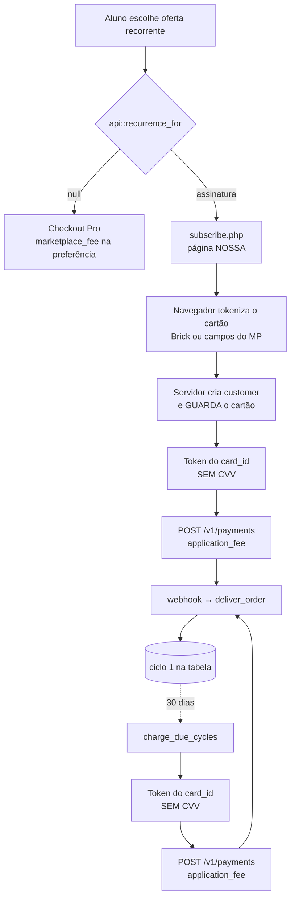
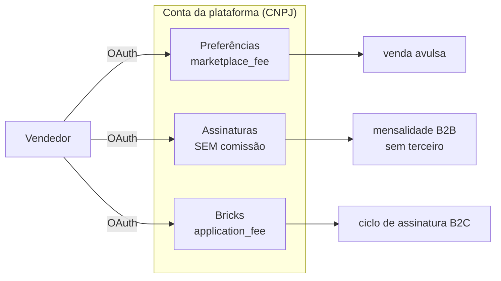

# Assinatura no Mercado Pago: como funciona, e por que é diferente do Asaas

Entrou em 16/09/2026. Este documento existe porque a palavra "assinatura"
descreve duas implementações que **não se parecem**, e tratá-las como a mesma
coisa levaria a decisões erradas de operação.

Decisões: [ADR-0012](../adr/0012-duas-assinaturas-e-so-uma-tem-split.md) e
[ADR-0013](../adr/0013-uma-aplicacao-por-tipo-de-integracao.md).
Medições: [`mercadopago-assinatura.md`](../data-validation/mercadopago-assinatura.md).

---

## A diferença em uma frase

**No Asaas o gateway cobra sozinho. No Mercado Pago quem cobra somos nós.**

Não é escolha de arquitetura: o `POST /preapproval` — a API de Assinaturas do
Mercado Pago — **não tem campo de comissão nenhum**. Aceita `marketplace_fee`,
`application_fee` e `marketplace`, na raiz e dentro de `auto_recurring`, devolve
`201` nos cinco formatos e descarta todos. Medido com a aplicação do tipo certo.

Então a assinatura com comissão no MP é uma **sequência de cobranças avulsas**
em `/v1/payments`, cada uma com `application_fee`, sobre um cartão que o
Mercado Pago guarda.

**Repare no laço**: o ciclo 1 percorre exatamente o mesmo caminho dos ciclos
seguintes. É deliberado — uma falha nesse trecho aparece na primeira compra,
com o aluno na tela, e não um mês depois num cron silencioso.

---

## As três aplicações

No Mercado Pago "aplicação" não é detalhe de cadastro: o **modelo declarado no
painel muda o comportamento da API em silêncio**.

**Cada uma exige o seu próprio OAuth** — medido: o mesmo vendedor recebeu três
tokens distintos. O `redirect_uri` é o mesmo nas três, e o tipo viaja na
sessão: o MP exige que o endereço case exatamente com o cadastrado, e três URIs
seriam três chances de errar uma letra num erro que não diz qual aplicação
falhou.

---

## Onde o cartão é digitado

Três modos, e a escolha não é visual: ela decide o enquadramento PCI DSS do
projeto. Detalhe em [`pci-dss-captura-de-cartao.md`](../legal/pci-dss-captura-de-cartao.md).

| Modo | O PAN passa por | SAQ |
|---|---|---|
| `brick` (padrão) | iframes do MP | **A** |
| `direct` | nosso DOM | **A-EP** |
| `native` | nosso DOM **e** nosso backend | **D** |

**Sem HTTPS, `direct` e `native` não valem** — o código cai em `brick` sozinho.
Não é aviso, é recusa: segurança que depende de a configuração estar certa é o
desenho que este projeto recusa.

Em nenhum modo o número do cartão é gravado. A tabela não tem coluna capaz de
guardá-lo, e há teste lendo o `install.xml` para impedir que alguém acrescente
uma.

---

## O que muda na operação — e é aqui que o custo aparece

| | Asaas | Mercado Pago |
|---|---|---|
| Quem dispara o ciclo | o gateway | **a plataforma** |
| Cron parado | continua cobrando | **para de cobrar** |
| Cartão recusado | retentativa do gateway | aluno informa outro cartão |
| "Fatura em aberto" | `invoiceUrl` hospedada | **nossa página** (`subscribe.php`) |
| Cancelar | pede ao gateway que pare | marca e **para de disparar** |

**A primeira linha é a que importa, e a segunda é a consequência.** Com o cron
parado, uma assinatura do Asaas continua entrando dinheiro; uma do MP não. É
falha de que ninguém reclama, porque o sintoma é o vendedor recebendo menos — e
não o aluno perdendo acesso.

**Monitore a `charge_due_cycles` como se monitora dinheiro**, e não como se
monitora limpeza de cache.

---

## O que está provado, e o que não está

**Provado:**

- o `preapproval` não carrega comissão — cinco formatos, `201`, zero ecos;
- o `/v1/payments` **honra** o `application_fee` — pagamento `1352076103`,
  aprovado, comissão em `fee_details`;
- o Mercado Pago emite token de cartão guardado **sem CVV** (`status: active`);
- tokenizar no servidor com token de acesso é **403** — só a `public_key`;
- cada aplicação exige o seu OAuth.

**Não provado, e não se deve tratar como se fosse:**

- **a travessia do `application_fee` entre contas distintas** numa assinatura.
  No pagamento medido, o `collector_id` era o dono da aplicação — vendedor e
  marketplace na mesma conta, que é a armadilha que já fez o split "funcionar"
  sem transferir nada. Prova de split no MP é com conta real;
- **a cobrança do cartão guardado**: no arranjo do sandbox devolve `500`;
- **a taxa de aprovação** de cobrança iniciada pelo estabelecimento. O suporte
  do MP avisa que pode ser pior, e prova de tokenização **não é** prova de
  aprovação;
- `/v1/advanced_payments`: `403` de política, precisa de liberação comercial.
