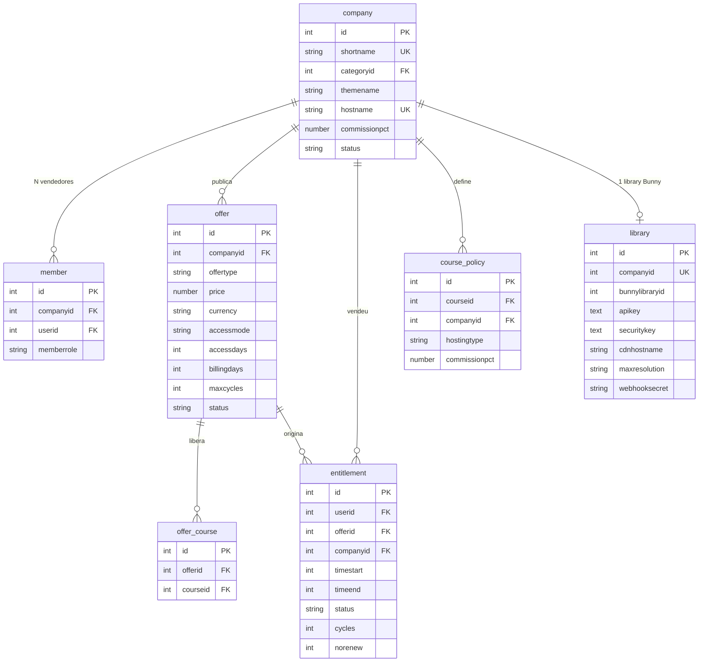

# Modelo de dados do marketplace

As tabelas dos cinco plugins, o que cada campo resolve, e as relações entre elas.

> Extraído de [`../dev/guia-desenvolvedor.md`](../dev/guia-desenvolvedor.md), que
> continua sendo o documento de referência para configuração, testes, domínio por
> vendedor e armadilhas.

---

## Modelo de dados

> **A credencial de pagamento não vive aqui.** Ela fica em
> `payment_gateways.config` do core, na conta de pagamento criada no contexto da
> categoria da empresa. Guardar uma cópia criaria duas fontes de verdade para uma
> credencial financeira — a tabela `local_marketplace_mpaccount` existiu e foi
> removida por isso.

## Tabelas, campo a campo

### `local_marketplace_company`

A empresa vendedora. Uma empresa = uma categoria de cursos.

| Campo | Para que serve |
|---|---|
| `shortname` | Único. Vira o `idnumber` da categoria e entra nas URLs da vitrine e do painel. **Não é editável** — trocar quebraria links já divulgados. |
| `categoryid` | Categoria provisionada na criação. É o contexto onde vivem o papel de vendedor e a conta de pagamento. |
| `themename` | Tema da categoria. Depende de `$CFG->allowcategorythemes`, garantido pelo `install.php`. Vazio limpa e volta ao tema do site. |
| `hostname` | Único. Domínio próprio do vendedor. Resolve pelo mapa gerado — ver *Domínio por vendedor* abaixo. |
| `commissionpct` | Comissão negociada, de 0 a 100. **Nulo herda o padrão do site** — nulo e zero são coisas diferentes. |
| `commissionbase` | `gross` ou `net`. **Nulo herda a base do site.** Só é lida quando `commissionpct` também está preenchida: a base sai do mesmo degrau que deu a taxa. |
| `planid` | Plano contratado. Nulo = provisionada antes de existirem planos, ou fora de plano — a cadeia pula o degrau. |
| `status` | `active` ou `suspended`. Não há aprovação manual: os portões são a conta de pagamento e o papel restrito. |

### `local_marketplace_member`

N vendedores por empresa; uma pessoa pode estar em várias.

| Campo | Para que serve |
|---|---|
| `memberrole` | `owner` ou `seller`. As capabilities são as mesmas — a distinção existe para impedir que a empresa fique sem responsável pela conta de pagamento. |

> **O vínculo são duas coisas inseparáveis.** Gravar a linha e atribuir o papel
> `marketplaceseller` no contexto da categoria. Só a linha produz alguém que
> consta como vendedor e não consegue fazer nada; só o papel produz alguém
> invisível ao marketplace. Use sempre `api::add_member()` e
> `api::remove_member()`.

### `local_marketplace_offer`

A unidade de **venda**. O curso deixa de ser o que se vende e passa a ser o que
se libera.

| Campo | Para que serve |
|---|---|
| `offertype` | `single` um curso · `bundle` conjunto escolhido · `catalog` tudo da categoria, com cursos novos entrando sozinhos. |
| `price` | Zero torna gratuita, e ofertas gratuitas não passam por gateway nenhum. |
| `country` | ISO-3166 alpha-2. Decide a conta que recebe, a moeda e quais gateways aparecem no checkout. Vive aqui e não na empresa porque `get_payable()` resolve tudo pelo `itemid`, sem saber quem compra. |
| `currency` | **Derivada** do `country`, em `before_validate()`. Não é escolha: uma conta do país X só recebe na moeda de X, e não há câmbio no caminho do split. |
| `accessmode` | `lifetime` · `days` · `recurring`. |
| `accessdays` | Quanto acesso **cada pagamento** libera. |
| `billingdays` | De quanto em quanto tempo se espera o próximo pagamento. Só em `recurring`. |
| `maxcycles` | Quantas cobranças a assinatura admite. `0` = sem limite. |

> **Por que `accessdays` e `billingdays` são separados.** Permitem carência:
> cobrar a cada 30 dias liberando 35 dá margem para o pagamento atrasar sem
> cortar o aluno. Se fossem o mesmo campo — como eram — a carência não existiria.
> E `maxcycles` é o que distingue "mensal por 12 meses" de "mensal enquanto
> quiser".

### `local_marketplace_account`

Conta de pagamento da empresa **em cada país**. Existe porque o `core_payment`
escopa conta por contexto, e todas as contas de uma empresa vivem no mesmo — o da
categoria dela. Sem uma chave por país, `account::get_record(['contextid' => …])`
devolvia *a primeira que aparecesse*, e uma empresa que vende no Brasil e na
Argentina passava a receber em ordem de id.

| Campo | Para que serve |
|---|---|
| `country` | ISO-3166 alpha-2. Único junto com `companyid`. |
| `accountid` | `payment_accounts.id` do core. A conta em si continua sendo dele — aqui mora só o vínculo. |

Ver [ADR-0002](../adr/0002-conta-de-pagamento-por-pais.md).

### `local_marketplace_library`

**Nova em 25/09/2026 (Frente B, ADR-0014).** Library da Bunny de cada empresa,
dentro da conta **única** da plataforma — o mesmo padrão de
`local_marketplace_account` (empresa x recurso externo), mas 1:1: sem dimensão
de país, porque não há "uma library por país" nesta frente. Provisionada
automaticamente em `api::create_company()`; sem chave de conta da plataforma
configurada, a empresa nasce do mesmo jeito e a library fica em espera (linha
ausente, não erro).

| Campo | Para que serve |
|---|---|
| `companyid` | Único: uma library por empresa. |
| `bunnylibraryid` | Id da library na Bunny. |
| `apikey` | Chave **da library** (não a de conta da plataforma), cifrada com `\core\encryption`. É o único campo que a API da Bunny devolve na criação — verificado ao vivo em 25/09/2026 contra a conta real. |
| `securitykey` | Chave de autenticação por token do player, cifrada. **Nula até o próximo sub-passo**: a Bunny não devolve isto na criação, só depois de habilitar `PlayerTokenAuthenticationEnabled` na library. |
| `cdnhostname` | Hostname da pull zone de entrega. **Nulo até o próximo sub-passo**: a criação devolve só o `PullZoneId` numérico, e o hostname exige uma chamada separada a `/pullzone/{id}`. |
| `maxresolution` | Cache do último teto aplicado no `EnabledResolutions` da library (campo real confirmado ao vivo: `"240p,360p,480p,720p,1080p"`). Fonte da verdade continua `plan::max_resolution_for()`. |
| `webhooksecret` | Gerado sozinho na criação (`before_create()`), único por library. É como o `mod_bunnystream` identifica de qual empresa veio um `POST` em `/mod/bunnystream/webhook.php` — nunca um segredo único compartilhado (diferença do plugin de referência, que usa singleton). |

A chave de **conta** da plataforma (usada só para criar libraries novas) não
mora nesta tabela — é uma só, fica em admin setting cifrado
(`local_marketplace/bunnyaccountapikey`).

Ver [ADR-0014](../adr/0014-trava-de-resolucao-por-mensalidade-do-vendedor.md).

### `local_marketplace_sale`

O que o marketplace precisa saber de uma venda e o `core_payment` não guarda.
Valor, moeda, gateway, comprador e data ficam em `{payments}`, que é a fonte da
verdade — duplicar daria duas versões do mesmo número financeiro.

| Campo | Para que serve |
|---|---|
| `paymentid` | `payments.id` do core, único. Uma venda por pagamento. |
| `feeamount` | Comissão **efetivamente** enviada, em moeda. Não recalcule a partir do percentual: estorno parcial e split recusado mudam este valor depois da criação. |
| `feepercent` | Percentual **aplicado** nesta venda. |
| `feebase` | Base **aplicada**: `gross` ou `net`. |
| `feesource` | De onde os termos vieram: `policy` · `company` · `plan` · `site`. |
| `externalid` | Id da transação no gateway, para conciliar com o extrato dele. |
| `companyid` | Desnormalizado: o relatório filtra por empresa a cada página. |

**Os três campos de termo são uma FOTO, e é o ponto deles.** A taxa da empresa, o
plano dela e o padrão do site mudam; sem a foto, uma venda de seis meses atrás só
poderia ser explicada relendo a configuração de hoje, e o relatório passaria a
contar uma história diferente da do extrato.

`feebase` guarda o que foi **aplicado**, e não o que estava configurado — no
Mercado Pago não há como cobrar sobre o líquido, então lá a venda registra
`gross` mesmo com `net` configurado. Ver
[ADR-0007](../adr/0007-comissao-sobre-o-bruto.md).

Existe porque o relatório lia a tabela do `paygw_mercadopago` direto. Com um
segundo gateway aquilo passaria a **mentir por omissão** — a venda existiria, o
aluno estaria matriculado, e o total simplesmente não contaria o dinheiro.
Ver [ADR-0001](../adr/0001-gateways-alem-do-mercado-pago.md).

### `local_marketplace_entitlement`

O que o aluno comprou. Fonte da verdade do acesso.

| Campo | Para que serve |
|---|---|
| `companyid` | Desnormalizado de propósito: o acesso ao catálogo consulta por empresa a cada página. |
| `timeend` | `0` = vitalício. A vigência confere **a data além do status**: o status só muda quando o cron roda, e confiar nele daria acesso grátis na janela entre o vencimento e a próxima execução. |
| `status` | `active` · `expired` · `cancelled`. `cancelled` é **revogação imediata**, para estorno e fraude. |
| `cycles` | Quantas cobranças já foram pagas. Contado aqui e não na tabela do gateway, porque o limite é regra do marketplace: trocar de meio de pagamento não pode zerar a contagem. |
| `norenew` | O aluno cancelou a assinatura. **Não revoga** — o acesso corre até `timeend`, porque ele pagou por aquele período. Só interrompe os avisos. |

### `local_marketplace_course`

Política de hospedagem e comissão, por curso.

| Campo | Para que serve |
|---|---|
| `hostingtype` | `external` ou `platform`. Hoje só `external` é aceito — `platform` é recusado na validação até a decisão de negócio da Fase 5. |
| `commissionpct` | Percentual retido. Só se aplica em oferta de **curso único**. |
| `commissionbase` | `gross` ou `net`. Nulo herda a base do site. |

> **Esta coluna faltou em produção entre 01/09 e 11/09/2026.** O passo de upgrade
> `2026090110` a acrescentou a `local_marketplace_course_policy` — nome tirado da
> classe (`course_policy`), e não da constante `TABLE` dela. O `table_exists()`
> do próprio passo devolveu falso e nada foi criado, em silêncio.
>
> O sintoma não era erro: o `insert_record` do Moodle descarta campo ausente da
> tabela, então a política salvava **sem** a base e a leitura devolvia nulo — que
> significa "herda a do site". Base líquida negociada saía cobrada sobre o bruto.
> Instalação nova nunca foi atingida: o `install.xml` sempre declarou a coluna.
>
> Corrigido pelo passo `2026091110`. O `check_database_schema.php` do core é o
> instrumento que enxerga esse tipo de divergência, e `db_schema_test.php` é o
> teste que impede a volta.

### `local_marketplace_plan`

O plano comercial. Nasce de um seed e é **editável por tela** — preço muda por
decisão comercial, não por deploy.

| Campo | Para que serve |
|---|---|
| `shortname` | Único, e é a **chave estável**: `starter` · `pro` · `scale`. O `name` muda com o marketing; este não. |
| `monthlyfee` | Mensalidade. **Ainda não é cobrada** — a recorrência está bloqueada. |
| `commissionpct` | Comissão do plano, de 0 a 100. **NOT NULL**, ao contrário da empresa: o nulo da empresa significa "não negociamos nada", e um plano sempre negociou. |
| `commissionbase` | `gross` ou `net`. Nulo herda a base do site — é o plano que só define a taxa e aceita a política geral. |
| `country` / `currency` | Valor tem país. Plano em outro país é outra linha, pela mesma razão da oferta. |
| `hostingmodel` | `native` (a plataforma absorve o custo de vídeo) ou `byos` (o produtor conecta a chave dele). |
| `ispublic` | Aparece na landing. Plano sob medida existe sem estar na vitrine. |
| `status` | `active` ou `archived`. **Plano nunca é apagado** — há empresa apontando para ele e histórico de comissão dependendo. |

O seed é **idempotente por `shortname` e só insere, nunca faz update**. Um deploy
não pode sobrescrever preço que alguém ajustou.

### `local_marketplace_plan_tier`

A trava de resolução por faixa de ticket, do plano nativo.

| Campo | Para que serve |
|---|---|
| `planid` | Plano dono da faixa. |
| `maxprice` | Teto da faixa. **`NULL` = a última faixa, a sem teto.** Guardar um número enorme transformaria "sem limite" em "limite que alguém escolheu". |
| `maxresolution` | `720p` · `1080p` · `1440p` · `4k`. |
| `sortorder` | A landing itera ordenado. |

É tabela, e não JSON em coluna, por três motivos: a base não usa JSON em coluna
nenhuma, a landing precisa iterar ordenado, e um dia alguém vai perguntar ao
banco qual plano libera 4K.

> **A trava ainda não é aplicada em lugar nenhum.** Estes dados existem e
> aparecem na vitrine, mas nada limita a resolução do player. Ver
> [ADR-0005](../adr/0005-trava-de-resolucao-por-ticket.md).

### `local_partners_application`

A candidatura de empresa parceira. Vive no `local_partners`.

**Não é uma empresa: é um pedido.** Aprovar cria uma **categoria de curso**, que
é objeto global do site — por isso existe uma fila, e alguém decide.

| Campo | Para que serve |
|---|---|
| `status` | `unconfirmed` · `pending` · `approved` · `rejected`. A `unconfirmed` **não entra na fila**: é envio anônimo que ainda não clicou no link do e-mail. Depois de decidida nunca volta para `pending` — reenvio é linha nova, para o histórico não sumir. |
| `userid` | Quem enviou, quando veio de alguém autenticado. É o **dono natural** da empresa: quem já tem perfil não precisa de conta nova nem de confirmar e-mail que o site já confirmou. |
| `confirmtoken` | Token do link de confirmação. Uso único, apagado assim que confirma. |
| `timeconfirmed` | Quando o e-mail foi provado. Nulo em candidatura que nunca precisou confirmar. |
| `planid` | Plano escolhido na landing. É **intenção, não contrato** — quem grava o plano na empresa é a aprovação. |
| `companyid` | Empresa criada na aprovação. É o que torna **aprovar idempotente**: preenchido, a segunda aprovação não cria uma segunda categoria. |
| `submitterip` | Serve ao limite de taxa e a nada mais. Sai no privacy provider e é apagado junto com a candidatura. |

`planid` **sem chave estrangeira declarada**: ela apontaria para tabela de outro
plugin, e o `check_database_schema` reclamaria num ambiente em que a ordem de
desinstalação divergisse. A integridade vem do `validate_planid()` do persistent.

Candidatura nunca confirmada é apagada pela tarefa
`\local_partners\task\purge_unconfirmed` — o formulário é público e anônimo, e
sem prazo a tabela vira depósito de dado pessoal de gente que talvez nem exista.

### `paygw_mercadopago`

Transações. Vive no plugin do gateway, não no marketplace.

| Campo | Para que serve |
|---|---|
| `externalreference` | A chave de ligação. O ID do pagamento só existe **depois** que o aluno paga, então precisamos de algo nosso acompanhando desde a criação da preferência. |
| `accountid` | Conta que recebe. É dela que sai o token para consultar o pagamento. |
| `feeamount` | `marketplace_fee` enviado, em moeda. É **valor absoluto**: a plataforma recebe exatamente isto. |
| `feepercent` | Percentual aplicado. |
| `feebase` | Aqui é **sempre `gross`**, e não por escolha: o `marketplace_fee` é absoluto e a taxa do MP só é conhecida depois. Com `net` configurado, a linha registra `gross` — que é o que de fato aconteceu. |
| `feesource` | `policy` · `company` · `plan` · `site`. |
| `status` | Espelha o Mercado Pago: `pending` · `approved` · `rejected` · `refunded` · `cancelled`. |

> **Não confunda com a ordem de dedução.** A taxa do Mercado Pago sai primeiro,
> do lado do vendedor, e o `marketplace_fee` sai do que sobra. Isso muda **quem
> absorve a taxa**, e não quanto a plataforma recebe.

### `paygw_asaas`

Transações do Asaas. Mesma ideia, com duas diferenças que valem.

| Campo | Para que serve |
|---|---|
| `environment` | `sandbox` ou `production`. Guardado **na linha** porque uma cobrança criada em homologação não pode ser consultada com a chave de produção: as bases não compartilham dados. |
| `feepercent` | Percentual resolvido no momento da compra. Guardado porque a comissão da empresa pode mudar depois, e a venda antiga precisa continuar explicável. |
| `feeamount` | Comissão em moeda, calculada sobre o valor **bruto**: R$ 100 a 25% são R$ 25,00. Vai aos gateways como valor absoluto (`fixedValue` no Asaas, `marketplace_fee` no Mercado Pago), e não como percentual — o `percentualValue` do Asaas incidiria sobre o `netValue` e devolveria menos. Depois da criação vale o que o gateway devolveu. |
| `feebase` | Base aplicada. **Decide o campo do split:** `gross` vai como `fixedValue` calculado por nós, `net` vai como `percentualValue` para o Asaas dividir o líquido dele. |
| `feesource` | `policy` · `company` · `plan` · `site`. Viaja até a venda no marketplace. |
| `billingtype` | `UNDEFINED` deixa o aluno escolher · `PIX` · `BOLETO` · `CREDIT_CARD`. |

A credencial do vendedor **não** fica aqui: vive cifrada no
`payment_gateways.config` do core, por ambiente. Ver
[ADR-0003](../adr/0003-quem-cria-a-cobranca-emite-a-nota.md).

### `paygw_pagarme`

Transações do Pagar.me. Uma linha por cobrança; assinatura tem uma linha por
ciclo, ligadas pelo `subscriptionid`.

| Campo | Para que serve |
|---|---|
| `orderid` | `or_…`. Vazio em cobrança de assinatura, que nasce sem order. |
| `chargeid` | `ch_…`. É por ele que o webhook encontra a linha. |
| `paymentmethod` | `pix` · `boleto` · `credit_card`. Diferente do Asaas, **não há opção "o aluno escolhe"**: o split de Pix exige o `POST /orders` transparente, e cada meio tem uma página nossa diferente. |
| `qrcode` | O copia-e-cola do Pix, guardado para a página própria não depender de nova chamada à API a cada recarregamento. |
| `checkouturl` | Página do boleto, ou imagem do QR Code. |
| `feebase` | Base aplicada. **Decide o tipo do split:** `gross` vira `flat` em centavos calculado por nós, `net` vira `percentage` para o Pagar.me dividir. |
| `environment` | Na linha, como no Asaas — mas aqui o ambiente vem do **prefixo da chave** (`sk_test_` × `sk_`), não de um host separado: `sdx-api.pagar.me` não existe. |

O que **não** fica aqui, e é a diferença que mais surpreende: o recebedor da
plataforma. No Asaas a carteira da plataforma é uma só e vive nas settings do
site; no Pagar.me um `recipient` é objeto **interno a uma conta**, então o `rp_`
da plataforma é diferente dentro de cada vendedor. Ele acompanha a conta de
pagamento, cifrado junto com a chave.

### `format_ldg_lesson`

A duração de cada aula, no formato de curso **Portal LDG**.

**Não é dado de pessoa.** Guarda o tempo do *vídeo*, por atividade — não o tempo
que alguém assistiu. É essa distinção que mantém o `format_ldg` como
`null_provider` de privacidade: sem `userid`, isto é conteúdo do curso. Se um dia
passar a guardar progresso de reprodução por usuário, o provider deixa de valer.

| Campo | Para que serve |
|---|---|
| `cmid` | O `course_modules.id` da aula. Índice **único**. |
| `duration` | Segundos. **Nulo é "não sei"**, e a lista simplesmente não mostra nada — diferente de zero, que seria uma aula de duração nenhuma. |

**Sem chave estrangeira para `course_modules`, de propósito.** A atividade pode
ser apagada e o curso pode trocar de formato; a linha órfã não pode impedir nem
uma coisa nem outra. Dado de formato nunca pode travar a troca de formato.

Por isso a limpeza é seletiva: trocar para o formato de seções e voltar
**preserva** as durações, e só a exclusão do **curso** apaga, pelo
`delete_format_data()`.

O backup carrega a duração pelo ponto de conexão de **módulo**, e no restore o
`cmid` vem sempre da tarefa, nunca do arquivo — restaurar cria atividades com ids
novos, e gravar o id antigo apontaria a duração para a atividade errada. Esse
erro não dá mensagem: só aparecem números trocados.
