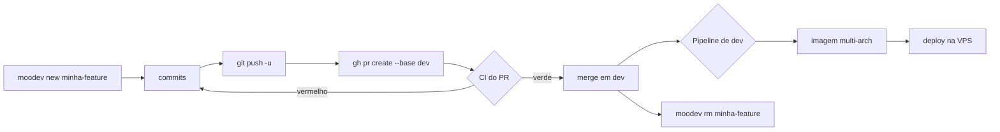

# Da worktree ao deploy

O caminho de uma mudança: branch → PR → `dev` → VPS. Não há PR `dev`→`main` no
caminho normal.



**O PR não toca na VPS.** Os jobs de imagem e deploy têm
`if: github.event_name != 'pull_request'`, então um PR roda apenas `validate` e
`thirdparty`. Quem dispara o deploy é o **merge em `dev`**.

---

## A ordem que impede commit órfão

Commit empurrado depois do merge **não entra em lugar nenhum**. Ele fica na
branch, o PR já fechou, e ninguém percebe até a funcionalidade faltar em
produção. Já aconteceu **seis vezes** neste projeto — é o erro mais repetido do
histórico, e ele não vem de descuido: vem de abrir o PR cedo demais.

A ordem existe para tornar o erro impossível, não para lembrar de evitá-lo:

```
1. terminar TUDO          codigo, teste, phpcs, behat, documentacao
2. rodar a verificacao    o que o CI vai rodar, lido por inteiro
3. commitar tudo          git status tem que sair vazio
4. so entao: push + PR
5. CI verde
6. merge
```

**O passo 1 é o que falha.** "Abro o PR e depois acerto a documentação" é
exatamente como o commit órfão nasce. Se faltar qualquer coisa, o PR ainda não
pode existir.

### Se precisar mesmo empurrar depois

Acontece — revisão pediu mudança, o CI pegou algo. Aí a regra é **conferir que o
PR ainda está aberto antes de empurrar**:

```bash
gh pr view <numero> --json state -q .state     # tem que dizer OPEN
git push
```

`MERGED` ali quer dizer que o commit vai ficar órfão. Nesse caso, não empurre:
abra uma branch nova a partir de `dev` já atualizada e leve a mudança nela.

### Como saber que já aconteceu

```bash
git log --oneline origin/dev..<sua-branch>     # vazio = tudo chegou em dev
```

Se sobrar commit aí depois do merge, ele é órfão. Recuperar é `git cherry-pick`
numa branch nova — foi assim que o PR #79 salvou dois commits perdidos.

---

## 1. Antes de abrir

```bash
cd <worktree>
git status                                   # nada solto?
git log --oneline HEAD --not --remotes       # o que vai no PR
```

Confira que os commits são só os seus. Se aparecer commit de outra branch, você
está na worktree errada.

Rode o que o CI vai rodar, para não descobrir pelo robô:

```bash
moodev shell
php vendor/bin/phpunit --testsuite local_marketplace_testsuite
```

E o `phpcs` — **leia o total, não corte a saída** (ver
[`../coding-standards/`](../coding-standards/README.md)).

---

## 2. Empurrar e abrir o PR

```bash
git push -u origin <sua-branch>

gh pr create --base dev --head <sua-branch> \
  --title "..." \
  --body-file /tmp/pr-body.md
```

> **Use `--body-file`, não `--body`.** Corpo longo pela linha de comando já
> falhou com `HTTP 499` no meio do caminho, e o PR não chega a ser criado. Com
> arquivo, repetir o comando é trivial.

### O que escrever no corpo

O título diz *o que*. O corpo existe para o *porquê* — e principalmente para o
que um leitor não descobre lendo o diff:

- **O problema**, com o sintoma concreto que o revelou
- **A alternativa recusada** e a razão. Costuma ser a parte mais valiosa
- **O que foi medido**, não o que se espera. "~1 s, medido" vale mais que
  "deve ficar rápido"
- **O que a VPS vê**, se a mudança encostar em `compose/` ou no workflow
- **O que ficou de fora**, de propósito

Descobertas laterais merecem seção própria. Um PR que conserta três coisas que
ninguém pediu precisa dizer isso — senão o revisor pensa que são efeitos
colaterais.

---

## 3. Acompanhar o CI

```bash
gh pr checks <n>
gh run watch <run-id> --exit-status
```

No PR devem aparecer só dois jobs verdes e três pulados:

```
success  Validar plugins proprios
success  Testar plugins de terceiros (informativo)
skipped  Build da imagem
skipped  Publicar manifesto multi-arch
skipped  Deploy na VPS Oracle
```

Os três pulados são a confirmação de que **o PR não mexeu em produção**.

> Rode o `gh run watch` de um diretório que vá continuar existindo. Se a
> worktree for removida enquanto ele roda, o comando morre com
> `Unable to read current working directory` — falha do watcher, não do CI.

---

## 4. Merjear

```bash
gh pr merge <n> --merge
```

`--merge` preserva o commit de merge, que é o padrão deste repositório
(`Merge pull request #NN from ...`).

**O merge dispara o deploy.** O pipeline em `dev` roda tudo:

| Job | O que faz |
|---|---|
| `validate` / `thirdparty` | de novo, agora sobre o merge |
| `image` (matriz) | compila amd64 e arm64, cada um em runner nativo |
| `image-manifest` | funde os digests em `:development` |
| `deploy` | atualiza a VPS |

O `image-manifest` **falha de propósito** se o manifesto não tiver as duas
arquiteturas. É proteção contra publicar pela metade: melhor travar do que
deixar a VPS ou a máquina de desenvolvimento sem imagem.

```bash
gh run list --branch dev --limit 1
gh run watch <run-id> --exit-status
```

Se o deploy falhar, **a VPS continua na imagem anterior** — o
`docker compose pull` só troca o container depois de baixar com sucesso. O risco
é ficar sem atualização, não fora do ar.

---

## 5. Depois do merge

```bash
# 1. dev alimenta o moodev do PATH — atualize primeiro
cd ~/localhost/gitworktree-bare-moodle/dev
git pull --ff-only origin dev

# 2. confirme na VPS
curl -s -o /dev/null -w '%{http_code}\n' https://courses.leodg.dev/

# 3. só então remova a worktree
moodev rm <worktree>
```

A ordem importa. Se a mudança mexeu no próprio `moodev`, o comando do PATH só passa
a ser o novo depois do passo 1 — antes disso você roda a versão antiga sem
perceber. E se a worktree removida for a servida, o `moodev rm` move o stack para
`dev` sozinho (ver [`moodev.md`](moodev.md#6-moodev-rm)).

---

## Verificar o impacto na VPS antes de merjear

Se o PR toca `compose/` ou `deploy.yml`, confira o que a VPS passa a enxergar. O
`COMPOSE_FILE` dela é **só três arquivos**:

```bash
cd <worktree>
COMPOSE_FILE=.devcontainer/compose/base.yml:.devcontainer/compose/db.yml:.devcontainer/compose/dev.yml \
COMPOSE_ENV_FILE=.env docker compose config
```

Compare com a mesma saída antes da mudança. `local-tls.yml` e `local-dev.yml`
são locais e nunca entram nessa lista — é o que impede um ajuste de
desenvolvimento de vazar para produção.

E valide o workflow antes de empurrar:

```bash
docker run --rm -v "$PWD:/repo" -w /repo rhysd/actionlint:latest .github/workflows/deploy.yml
```

---

## Erros que já aconteceram aqui

**Commits empurrados depois do merge ficam órfãos.** Aconteceu **seis vezes**, e
é o erro mais repetido daqui. A ordem que o impede está no topo deste documento;
a regra curta é: só abra o PR quando **tudo** estiver pronto, e confirme
`gh pr view <n> --json state` antes de qualquer push adicional.

**Abrir PR de uma base errada.** A branch nasce de `origin/dev` por padrão; se
você usou `--from` apontando para outra coisa, o PR carrega commits que não são
seus. Confira com `git log --oneline origin/dev..HEAD` antes de abrir.

**Confiar no status do CI sem olhar o efeito.** Um pipeline verde diz que os
jobs rodaram, não que o site responde. Confirme com `curl` na VPS.

---

## Ver também

- [`moodev.md`](moodev.md) — o comando que cria e remove os ambientes
- [`guia-worktrees.md`](guia-worktrees.md) — portas, VS Code, o que não pode vazar para a VPS
- [`../ai-plans/`](../ai-plans/) — registrar o plano quando o trabalho for de agente de IA
