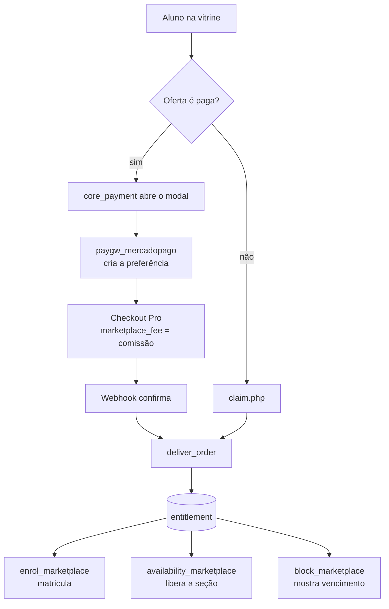
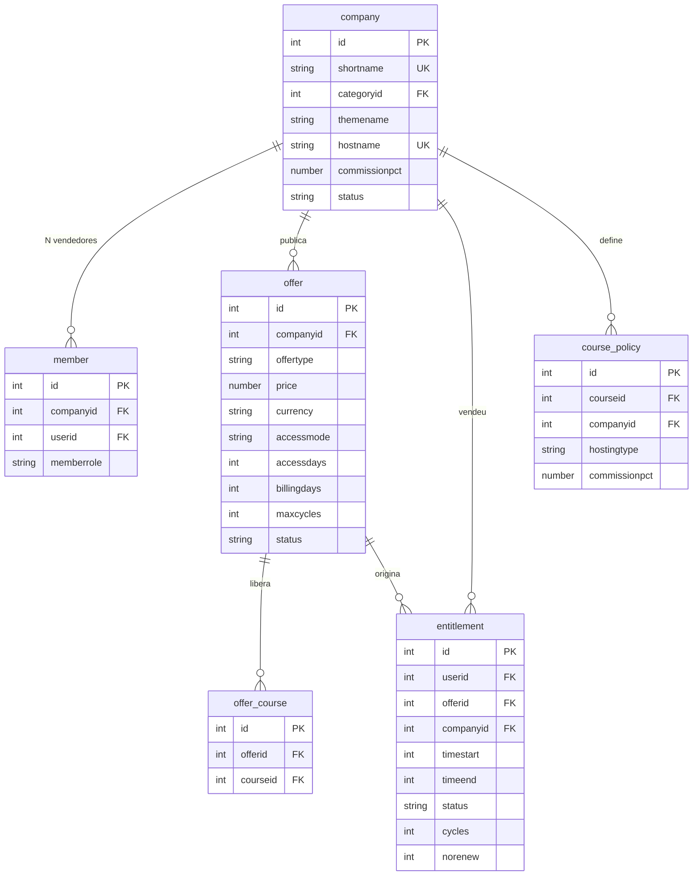

# Guia do desenvolvedor

Cinco plugins sobre um Moodle 5.2 sem fork. Modelo de dados, relações entre as
tabelas e o que configurar para o conjunto funcionar.

Atualizado em 2026-08-25.

## Como as peças se encaixam

A regra central: **o direito de acesso é a única fonte da verdade**. Ninguém
matricula diretamente e ninguém lê a venda para decidir acesso — matrícula e
liberação de seção consultam `local_marketplace_entitlement`. Duplicar essa
lógica abriria espaço para as duas discordarem.



## Modelo de dados



> **A credencial de pagamento não vive aqui.** Ela fica em
> `payment_gateways.config` do core, na conta de pagamento criada no contexto da
> categoria da empresa. Guardar uma cópia criaria duas fontes de verdade para uma
> credencial financeira — a tabela `local_marketplace_mpaccount` existiu e foi
> removida por isso.

## Tabelas, campo a campo

### `local_marketplace_company`

A empresa vendedora. Uma empresa = uma categoria de cursos.

| Campo | Para que serve |
|---|---|
| `shortname` | Único. Vira o `idnumber` da categoria e entra nas URLs da vitrine e do painel. **Não é editável** — trocar quebraria links já divulgados. |
| `categoryid` | Categoria provisionada na criação. É o contexto onde vivem o papel de vendedor e a conta de pagamento. |
| `themename` | Tema da categoria. Depende de `$CFG->allowcategorythemes`, garantido pelo `install.php`. Vazio limpa e volta ao tema do site. |
| `hostname` | Único. Domínio próprio do vendedor. Resolve pelo mapa gerado — ver *Domínio por vendedor* abaixo. |
| `commissionpct` | Comissão negociada, de 0 a 100. **Nulo herda o padrão do site** — nulo e zero são coisas diferentes. |
| `status` | `active` ou `suspended`. Não há aprovação manual: os portões são a conta de pagamento e o papel restrito. |

### `local_marketplace_member`

N vendedores por empresa; uma pessoa pode estar em várias.

| Campo | Para que serve |
|---|---|
| `memberrole` | `owner` ou `seller`, e **as capabilities são diferentes desde 04/09/2026**: o `owner` recebe o papel `marketplacemanager`, que alcança a conta de pagamento, os membros e o relatório; o `seller` recebe o `marketplaceseller`, que só monta curso. Nenhum dos dois coloca arquivo no site — ver [ADR-0009](../adr/0009-papeis-de-empresa-sem-upload.md). |

> **O vínculo são duas coisas inseparáveis.** Gravar a linha e atribuir **o papel
> que corresponde ao `memberrole`** no contexto da categoria — a tradução está em
> `roles::shortname_for()`, e `api::assign_member_role()` atribui um e tira o
> outro. Só a linha produz alguém que
> consta como vendedor e não consegue fazer nada; só o papel produz alguém
> invisível ao marketplace. Use sempre `api::add_member()` e
> `api::remove_member()`.

### `local_marketplace_offer`

A unidade de **venda**. O curso deixa de ser o que se vende e passa a ser o que
se libera.

| Campo | Para que serve |
|---|---|
| `offertype` | `single` um curso · `bundle` conjunto escolhido · `catalog` tudo da categoria, com cursos novos entrando sozinhos. |
| `price` | Zero torna gratuita, e ofertas gratuitas não passam pelo Mercado Pago. |
| `currency` | Validada contra a moeda em que a empresa realmente recebe, descoberta da conta vinculada. |
| `accessmode` | `lifetime` · `days` · `recurring`. |
| `accessdays` | Quanto acesso **cada pagamento** libera. |
| `billingdays` | De quanto em quanto tempo se espera o próximo pagamento. Só em `recurring`. |
| `maxcycles` | Quantas cobranças a assinatura admite. `0` = sem limite. |

> **Por que `accessdays` e `billingdays` são separados.** Permitem carência:
> cobrar a cada 30 dias liberando 35 dá margem para o pagamento atrasar sem
> cortar o aluno. Se fossem o mesmo campo — como eram — a carência não existiria.
> E `maxcycles` é o que distingue "mensal por 12 meses" de "mensal enquanto
> quiser".

### `local_marketplace_entitlement`

O que o aluno comprou. Fonte da verdade do acesso.

| Campo | Para que serve |
|---|---|
| `companyid` | Desnormalizado de propósito: o acesso ao catálogo consulta por empresa a cada página. |
| `timeend` | `0` = vitalício. A vigência confere **a data além do status**: o status só muda quando o cron roda, e confiar nele daria acesso grátis na janela entre o vencimento e a próxima execução. |
| `status` | `active` · `expired` · `cancelled`. `cancelled` é **revogação imediata**, para estorno e fraude. |
| `cycles` | Quantas cobranças já foram pagas. Contado aqui e não na tabela do gateway, porque o limite é regra do marketplace: trocar de meio de pagamento não pode zerar a contagem. |
| `norenew` | O aluno cancelou a assinatura. **Não revoga** — o acesso corre até `timeend`, porque ele pagou por aquele período. Só interrompe os avisos. |

### `local_marketplace_course`

Política de hospedagem e comissão, por curso.

| Campo | Para que serve |
|---|---|
| `hostingtype` | `external` ou `platform`. Hoje só `external` é aceito — `platform` é recusado na validação até a decisão de negócio da Fase 5. |
| `commissionpct` | Percentual retido. Só se aplica em oferta de **curso único**. |

### `paygw_mercadopago`

Transações. Vive no plugin do gateway, não no marketplace.

| Campo | Para que serve |
|---|---|
| `externalreference` | A chave de ligação. O ID do pagamento só existe **depois** que o aluno paga, então precisamos de algo nosso acompanhando desde a criação da preferência. |
| `accountid` | Conta que recebe. É dela que sai o token para consultar o pagamento. |
| `feeamount` | `marketplace_fee` enviado. **Não é 25% do líquido**: a taxa do Mercado Pago sai antes e a comissão incide sobre o resto. |
| `status` | Espelha o Mercado Pago: `pending` · `approved` · `rejected` · `refunded` · `cancelled`. |

## Hierarquia da comissão

Do mais específico para o mais geral:

1. **Curso** — `course_policy.commissionpct`, só quando a oferta libera um curso só
2. **Empresa** — `company.commissionpct`, quando não é nulo
3. **Site** — `paygw_mercadopago/defaultfeepercent`

A política de curso só entra em oferta de curso único porque **não existe
resposta correta para um combo**: três cursos com percentuais diferentes não
produzem um percentual do pacote. O maior seria predatório, o menor arbitrário, a
média um número que ninguém negociou.

A comissão da empresa é **nula** por padrão, não 25. É a diferença entre "não
negociamos nada" e "negociamos zero" — com `NOT NULL` e default, um parceiro
isento voltaria a pagar na primeira vez que alguém mudasse o padrão do site.

## Plugins

| Plugin | O que faz |
|---|---|
| `local_marketplace` | O núcleo. Empresas, vendedores, ofertas, direitos e política de curso. Implementa `core_payment\service_provider`, que é como o Moodle sabe quanto cobrar e o que entregar. Traz as telas de admin, o painel da empresa, a vitrine, os relatórios e a tarefa de aviso de vencimento. |
| `paygw_mercadopago` | Checkout Pro com split. Todo HTTP passa por `mp_client`, num arquivo só, porque a Orders API deve substituir a API de Preferências — concentrar transforma essa migração numa reescrita local em vez de uma caçada. OAuth com PKCE, renovação de token por cron, webhook como fonte da verdade. |
| `enrol_marketplace` | Matrícula por diferença: compara os cursos que os direitos vigentes liberam com as matrículas existentes e ajusta. Não é chamado pelo pagamento — lê os direitos. |
| `availability_marketplace` | Libera seção mediante compra. É o que faz "curso com tópicos grátis e tópicos pagos" funcionar. Aponte sempre a **oferta específica** nesse modelo — "qualquer oferta" incluiria a gratuita e destravaria tudo. |
| `block_marketplace` | Assinaturas do aluno no Dashboard, e o checklist de ativação para quem administra empresa incompleta (desde 18/09/2026) — derivado de `local_marketplace`, sem tabela nova. Mostra só o que exige ação; sem débito automático, o aluno precisa agir para continuar assinando, o e-mail chega uma vez, o bloco fica. |

## Configuração

### 1. Aplicação do Mercado Pago

Nível site, uma vez: `/admin/settings.php?section=paymentgatewaymercadopago`

| Campo | Valor |
|---|---|
| `clientid` | Número da aplicação, do par **Client ID + Client Secret** — não Public Key, não Access Token. |
| `clientsecret` | O par do anterior. Só aparece com produção ativada. |
| `platformsite` | País do marketplace. Decide o domínio de autorização e quais contas podem vincular. |
| `testmode` | Emite token de teste. Comprador, vendedor e aplicação precisam estar todos do mesmo lado. |
| `defaultfeepercent` | Comissão padrão. |

A URL de redirecionamento precisa estar cadastrada no painel do Mercado Pago,
caractere a caractere:

```
https://SEU_DOMINIO/payment/gateway/mercadopago/oauth_callback.php
```

### 2. Empresa

*Administração do site → Marketplace → Empresas*. Criar provisiona categoria,
papel do dono e conta de pagamento numa transação só.

### 3. Vínculo do vendedor

Painel da empresa → *Configurar Mercado Pago* → **Vincular**. Vincular já
habilita o gateway.

> **Vendedor e marketplace não podem ser a mesma conta.** O `marketplace_fee` não
> teria para onde transferir, e o split falha em silêncio — o valor cai inteiro e
> ninguém percebe até a conciliação.

### 4. Ofertas

Painel da empresa → *Nova oferta*. Planos em níveis são ofertas `recurring` do
tipo `bundle` com conjuntos diferentes de cursos; o completo pode ser `catalog`.

## Linha de comando

```bash
php local/marketplace/cli/status.php
php local/marketplace/cli/set_offer.php --list
php local/marketplace/cli/set_offer.php --company=demo --price=1.00
php local/marketplace/cli/seed_demo.php --company=teste --seller=vendedor1
```

Na VPS, dentro do container:

```bash
docker compose exec -T moodle \
  php /var/www/html/public/local/marketplace/cli/status.php < /dev/null
```

O `< /dev/null` importa: `exec -T` lê o stdin até EOF e engoliria o resto de um
script.

## Testes e padrão de código

```bash
# Ambiente
docker exec -u 1000:33 ldg-courses-moodle-1 \
  php /var/www/html/public/admin/tool/phpunit/cli/init.php

# Testes
docker exec -u 1000:33 -w /var/www/html ldg-courses-moodle-1 \
  php vendor/bin/phpunit --testsuite local_marketplace_testsuite
docker exec -u 1000:33 -w /var/www/html ldg-courses-moodle-1 \
  php vendor/bin/phpunit --testsuite paygw_mercadopago_testsuite

# phpcs (instalado em /tmp/cs no container)
./vendor/bin/phpcs --standard=moodle /var/www/html/public/local/marketplace
```

Estado em 2026-08-25: **33 testes passando, zero violações de phpcs**.

O `phpunit_dataroot` e o `moodledata` pertencem a `www-data`; rodar como
`-u 1000:33` (uid do host, grupo www-data) dá acesso aos dois sem quebrar o
Apache.

## Domínio por vendedor

Três camadas, e cada uma responde uma pergunta diferente:

| Camada | Pergunta | Onde |
|---|---|---|
| nginx | *o tráfego chega?* | `server` block por domínio, com `Host` preservado |
| Arquivo gerado | *este domínio existe?* | `$CFG->dataroot/marketplace_domains.php` |
| Banco | *a empresa está ativa?* | `after_config`, com `$DB` disponível |

**A segurança está no arquivo, não no nginx.** O `config.php` usa o `Host` apenas
como chave de busca numa lista gerada do banco:

```php
$marketplacehost = strtolower($_SERVER['HTTP_HOST']);
if (isset($marketplacemap[$marketplacehost]['wwwroot'])) {
    $CFG->wwwroot = $marketplacemap[$marketplacehost]['wwwroot'];
}
```

Um atacante mandando `Host: evil.com` não encontra a chave, o `if` não entra, e o
`wwwroot` continua o padrão. O cabeçalho só consegue **selecionar** entre domínios
já cadastrados — não introduzir um novo.

Isso importa porque `$CFG->wwwroot` derivado do `Host` sem validação é injeção de
cabeçalho: o Moodle passaria a gerar todo link apontando para o domínio do
atacante, inclusive o de redefinição de senha que sai por e-mail.

`SERVER_NAME` não serve aqui: o container roda Apache com `ServerName localhost`
atrás do proxy, então ele nunca carrega o domínio do vendedor. E com
`UseCanonicalName Off`, que é o padrão, o Apache o deriva do próprio `Host`.

**Suspensão é conferida no banco**, não no arquivo. Filtrar na geração faria o
domínio suspenso cair no site padrão em silêncio, e acoplaria suspender a
regenerar arquivo. O `after_config` bloqueia a plataforma inteira naquele domínio
e responde 503 com uma página explicando.

### Provisionar um domínio

```bash
sudo .devcontainer/nginx/provisiona-dominio.sh meuscursos.joao.com contato@leodg.dev
```

Confere o DNS, instala o `server` block, valida, recarrega e emite o certificado.
Depois disso falta cadastrar o domínio na empresa — sem isso a requisição chega
mas o visitante vê o site principal.

```bash
php local/marketplace/cli/domains.php            # mapa em vigor
php local/marketplace/cli/domains.php --rebuild  # regenera do banco
```

**Sem `$CFG->sessioncookiedomain`**, por decisão: a sessão passa a ser por domínio.
Quem entra em `meuscursos.joao.com` não está logado em `courses.leodg.dev`.

## config.php: template versionado, ajuste local separado

O `config.php` da VPS é **gerado** a cada deploy, a partir de
`.devcontainer/config/config-docker.php`. Editar direto lá não sobrevive ao
próximo deploy.

Ajuste específico de uma máquina vai em **`config-local.php`**, na raiz do site.
O template o inclui se existir, depois de todo o resto e antes do
`lib/setup.php` — então ele sobrescreve qualquer `$CFG` e ainda vale a tempo.

```bash
cp .devcontainer/config/config-local.php.example config-local.php
```

Ele está no `EXCLUDE` do rsync e no `.gitignore`: o deploy nunca o cria nem o
apaga, e ele nunca é versionado.

> **Por que não preservar o `config.php`, como antes.** Preservar protegia o
> ajuste manual, mas fazia mudança no template nunca chegar sozinha. Uma correção
> de `cachejs` ficou semanas sem efeito por isso, e recriá-lo à mão derrubou o
> site em 25/08/2026 — o arquivo foi removido e o script morreu antes de gerar o
> novo, deixando o instalador do Moodle exposto.
>
> A separação resolve os dois lados: o template chega sempre, o ajuste local
> nunca se perde.

A escrita é atômica — grava ao lado e move. Um `cp` interrompido deixaria o
`config.php` pela metade, e `config.php` truncado derruba o site inteiro, não uma
página.

## Acesso ao banco de fora

O container publica a porta do MariaDB em `127.0.0.1` por padrão — nada exposto.

Para conectar um cliente da sua máquina, o caminho sem alterar nada é o túnel
SSH:

```bash
ssh -N -L 3307:127.0.0.1:3307 ubuntu@<VPS>
```

O cliente aponta para `127.0.0.1:3307` e a autenticação é a do SSH.

Para acesso permanente — BI, integração, replicação — defina a *variable*
`DB_BIND_ADDR` no environment `development` do GitHub com o IP da interface do
WireGuard:

```bash
ip -4 addr show wg0 | grep -oP 'inet \K[\d.]+'
```

O banco passa a escutar na VPN e continua invisível na internet, sem abrir porta
em firewall de borda.

`DB_BIND_ADDR` mexe **só** na porta do banco. O Apache e o Xdebug seguem o
`BIND_ADDR`, que é fixo em `127.0.0.1` no deploy. Eram a mesma variável até
2026-08-25, e nessa forma o conselho acima derrubava o site: mudar a interface do
banco tirava o Apache do `127.0.0.1`, e o nginx da VPS fala com `127.0.0.1:8095`.

> **Não use `0.0.0.0`.** MariaDB exposto na internet é alvo de varredura
> constante — força bruta em `root` e CVEs conhecidas — e o ganho sobre a VPN é
> nenhum. Some-se que o `db.yml` define `MARIADB_ROOT_HOST="%"`: o `root` aceita
> conexão de qualquer origem, então a única barreira seria a senha.

> **Confira o IP antes de gravar a variable.** Se o valor não corresponder a uma
> interface existente na VPS, o Docker recusa o bind com *cannot assign requested
> address* e o container do banco não sobe.

Editar o `.env` direto na VPS não adianta: o deploy reescreve o arquivo inteiro a
cada execução, pelo mesmo motivo que o `config.php` é gerado.

## Armadilhas que já custaram tempo

| Sintoma | Causa |
|---|---|
| `Section error` | A seção do gateway é `paymentgatewaymercadopago`, não `paygw_mercadopago`. |
| `No define call` | `requirejs.php` serve `amd/src` quando não há `.map`. Não há transpilador: o `src` precisa ser AMD de verdade. |
| Dois cliques para comprar | `cachejs` desligado faz cada módulo AMD virar uma requisição. |
| `Uma das partes é de teste` | São três: comprador, vendedor e a aplicação. `test_token` coloca a aplicação do lado certo. |
| Ajuste no `config.php` da VPS some | Ele é **gerado** a cada deploy. Ajuste de máquina vai em `config-local.php`, que o deploy nunca toca. |
| Empresa sem meio de pagamento | `account::is_available()` exige o gateway habilitado, não só o token guardado. |
| Pix não aparece | A conta do vendedor precisa de chave Pix registrada. Conta de teste não tem. |
| Upgrade quebra em `messages.php` | `MESSAGE_DEFAULT_LOGGEDIN` e `LOGGEDOFF` não existem no 5.2. Use `MESSAGE_DEFAULT_ENABLED`. |

## Idiomas

`en`, `pt_br` e `es`, com **261 chaves em cada**, paridade conferida por script.

Espanhol genérico, não `es_ar`: o Moodle não traz `es_ar` no core, e a diferença
rioplatense aparece mais na voz do que no vocabulário de plataforma. O texto usa
voseo onde é natural.
