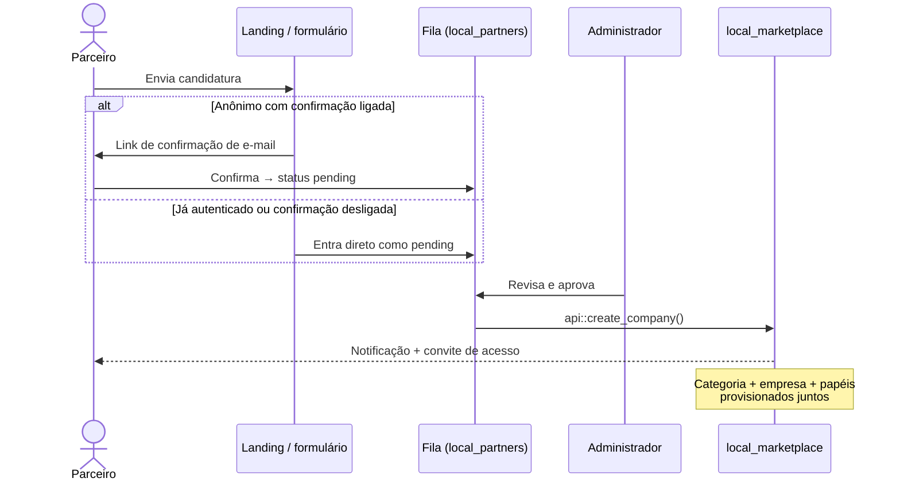
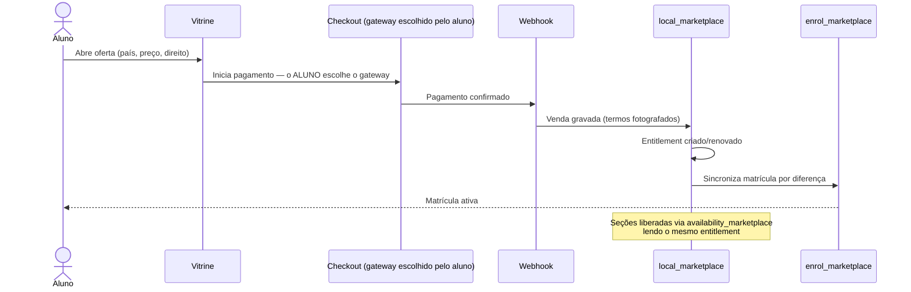
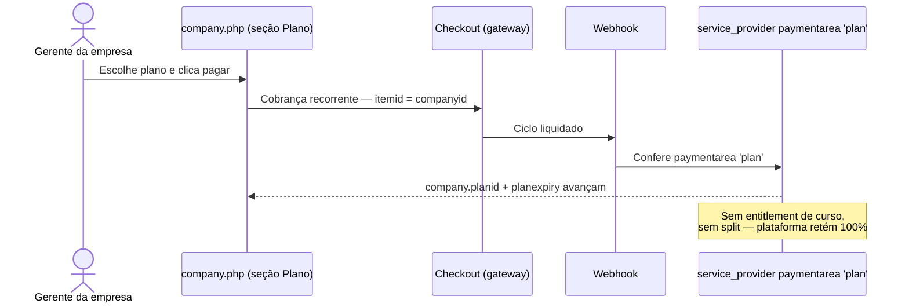
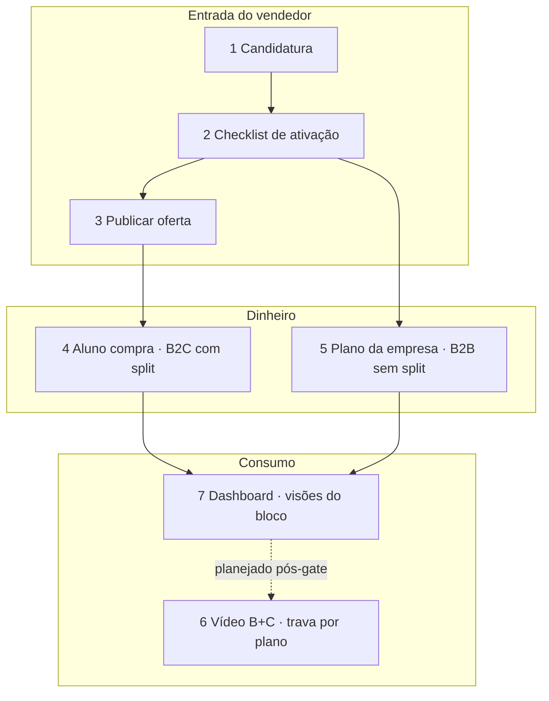

# Fluxos do app — vendedor/empresa como protagonista

> Este documento descreve os fluxos ponta a ponta do marketplace, na ordem em
> que a plataforma faz sentido para quem vende. É acompanhamento do
> [`prd.md`](prd.md) e do [`trd.md`](trd.md): aqui vive a narrativa de uso, não
> a arquitetura nem as tabelas — o detalhe fica nos donos próprios
> ([`../architecture/decisoes-marketplace.md`](../architecture/decisoes-marketplace.md),
> [`../data-model/marketplace.md`](../data-model/marketplace.md)).

**Protagonista:** o vendedor/empresa. O aluno aparece como consequência — quem
compra e assiste quando a empresa já publicou. Fluxos que dependem da frente de
vídeo (B+C) estão marcados **planejado (pós-Etapa 1 gate)** e não descrevem
tela que ainda não existe.

---

## 1. Parceiro vira empresa

Criar empresa cria uma **categoria de curso** — objeto global da árvore do site.
Por isso **não há auto-atendimento**: o candidato pede, alguém aprova, o
provisionamento acontece de uma vez só.

```
visitante → landing → candidatura → [confirma e-mail] → fila → aprovação → empresa
```

| Etapa | O que acontece | Dono |
|---|---|---|
| Candidatura | Formulário em `local_partners` grava um **pedido** (`local_partners`), não uma empresa | [`../../public/local/partners/README.md`](../../public/local/partners/README.md) |
| Confirmação de e-mail | Só anônimo com `requireemailconfirmation` ligado nasce `unconfirmed` e **não** entra na fila (nem notifica) até o link; autenticado ou confirmação desligada já nasce `pending` | idem |
| Fila | Só `pending` bloqueia duplicidade e notifica o revisor | idem |
| Aprovação | **Manual.** O ADR-0006 (aprovação automática) continua **Proposta**: [`../adr/0006-aprovacao-automatica-de-parceiro.md`](../adr/0006-aprovacao-automatica-de-parceiro.md) | capability `local/partners:review` |
| Provisionamento | A aprovação chama `api::create_company()`: categoria, empresa, papéis e plano — em uma chamada | [`../../public/local/marketplace/README.md`](../../public/local/marketplace/README.md) |



**Sem criação de categoria pelo vendedor.** Nenhum fluxo desta página abre
`core_course_category` por conta própria: quem provisiona é o admin, via
aprovação.

---

## 2. Ativação da empresa (checklist)

Empresa aprovada **nasce ativa no `local_partners`**, mas ainda pode não estar
pronta para vender. O que falta é derivado — sem tabela nova — pelo
`block_marketplace\onboarding` a partir de `company::get_plan()` e
`company::get_payment_accounts()`.

| Etapa | O que bloqueia? | Onde se resolve |
|---|---|---|
| Conta de pagamento **+ gateway habilitado no site** | **Sim** — `account::is_available()` exige o gateway habilitado, não só o vínculo | [`company.php`](../../public/local/marketplace/company.php) (seção de meio de pagamento) |
| Plano escolhido | **Sim** — sem plano não há degrau de comissão/mensalidade coerente | [`company.php`](../../public/local/marketplace/company.php) (seção Plano) |
| Documento informativo (CNPJ/CPF) | **Não** — informativo, nunca bloqueia | mesmas telas do painel |

**Onde o gerente vê o checklist:** no Dashboard (`/my/`), no bloco
`block_marketplace` — quem tem `local/marketplace:managecompany` naquela empresa
vê o resumo do que falta **em vez** do widget de assinatura do aluno. Empresa
completa devolve o widget de aluno; vendedor sem a capability nunca vê o
checklist, e ele nunca aparece em página de curso.

O bloco **não tem página própria**: o link leva a `company.php`, onde as etapas
já existiam. Desenho e implementação:
[`../ai-plans/2026-09-18-block-marketplace-onboarding-implementacao.md`](../ai-plans/2026-09-18-block-marketplace-onboarding-implementacao.md),
[`../../public/blocks/marketplace/README.md`](../../public/blocks/marketplace/README.md).

```mermaid
flowchart LR
    subgraph Dashboard [/my/]
        C[Checklist block_marketplace]
    end
    C -->|falta conta/plano| CP[company.php]
    C -->|documento só informativo| CP
    CP -->|etapas obrigatórias ok| W[Widget de assinatura do aluno<br/>ou estado completo]
```

---

## 3. Publicar curso pago

Com a empresa pronta, o vendedor publica. **A unidade de venda é a oferta, não o
curso** — o mesmo curso se vende em vários formatos (avulso vitalício, prazo,
combo, assinatura de catálogo); detalhe em
[`../architecture/decisoes-marketplace.md`](../architecture/decisoes-marketplace.md).

| Item | Por quê |
|---|---|
| **País em ISO na oferta** | `core_payment::get_payable()` não recebe o usuário: valor, moeda e conta são função do `itemid`. O split só ocorre entre contas do mesmo país |
| **Preço** | Vira o `itemid` da cobrança no checkout |
| **Direito de acesso** | A oferta entrega `local_marketplace_entitlement` — **fonte única de acesso**; matrícula e seções leem o direito, nunca a venda |

Quem publica precisa de `local/marketplace:publishcourse` no contexto da
categoria da própria empresa (papéis `marketplacemanager` / `marketplaceseller`).
Os dois papéis **não enviam arquivo**: o plano Free se sustenta em embed de
serviço externo, banda zero — ver ADR-0009 e o README do `local_marketplace`.

---

## 4. Aluno compra (consequência do fluxo do vendedor)

Fluxo já provado em produção: preferência, checkout, webhook, matrícula.



Pontos que sustentam o fluxo:

- **O gateway é escolha do aluno**, no checkout. A taxa de comissão **não varia
  por meio de pagamento** — nunca recalcule valores no relatório.
- **Venda ≠ acesso.** O webhook grava a venda; o acesso nasce do
  `local_marketplace_entitlement` e é o que `enrol_marketplace` e
  `availability_marketplace` leem.
- **Split:** a cobrança nasce na conta do vendedor (regra fiscal — ADR-0003);
  a comissão sai por split para a plataforma, com os termos fotografados na
  venda (ADR-0007). Detalhe em
  [`../architecture/decisoes-marketplace.md`](../architecture/decisoes-marketplace.md).
- **Venda recorrente de oferta** (`offertype` recorrente) usa o mesmo motor de
  ciclo dos gateways; avisos de vencimento e suspensão por diferença já estão
  em serviço. É a assinatura **B2C** (com split) — não confundir com o plano da
  empresa (seção 5).

---

## 5. Assinatura do plano da empresa (B2B — empresa paga à plataforma)

**Não é venda de curso.** É a mensalidade SaaS do degrau comercial
(`local_marketplace_plan`), paymentarea **`'plan'`**, `itemid` = `companyid`.
Sem split: a plataforma fica com 100% (`record_sale()` não grava venda para
`'plan'`). Ver [ADR-0012](../adr/0012-duas-assinaturas-e-so-uma-tem-split.md) e
[`trd.md`](trd.md) (Billing).



- O botão de pagar fica em `local/marketplace/company.php`, **sem tela nova**;
  a landing do `local_partners` manda o gerente logado de uma empresa só para
  lá.
- O que a empresa "entrega ao pagar" é `company.planid` + estado da assinatura
  do plano — **não** `local_marketplace_entitlement`.
- Conta receptora: `core_payment\account` da plataforma, no contexto do site,
  sem linha em `local_marketplace_company_account`.
- Prova e comandos:
  [`../data-validation/assinatura-saas-plano-empresa.md`](../data-validation/assinatura-saas-plano-empresa.md).

---

## 6. Consumo de vídeo (frente B+C) — **planejado (pós-Etapa 1 gate)**

**Outline apenas.** Implementação fica depois do gate da Etapa 1 (ordem das
frentes e critérios no [`prd.md`](prd.md)):

1. **Frente B** — Bunny nativo multi-tenant: uma `library` por empresa
   (isolamento no mesmo nível de categorias e contas).
2. **Frente C (dentro da B)** — trava de resolução por **mensalidade do
   vendedor**, aplicada no **player** (`core_media_manager`) e, quando o
   provedor cobra por volume, também na origem. O aluno não enxerga trilha acima
   do plano da empresa que hospeda.

O que **não** é este fluxo: o `mod_ldgvideo` atual (embed externo, plano Free)
continua em serviço — ver [`trd.md`](trd.md). Nenhuma tela nova de vídeo
é descrita aqui até o gate.

---

## 7. Dashboard — as duas visões

O mesmo bloco (`block_marketplace`) em `/my/` despacha por papel e contexto. As
duas visões **não se misturam**.

| Quem | O que vê |
|---|---|
| **Aluno** (com ou sem empresa) | Assinaturas de curso vigentes: o que exige atenção ou decisão — vencendo ou vencido. Histórico fica em página própria, não na barra do Dashboard |
| **Gerente** de empresa incompleta (`managecompany`) | **Checklist de ativação** (seção 2) em vez do widget de aluno |
| **Gerente** de empresa completa | Widget de assinatura do aluno volta (se também for aluno) |
| **Vendedor** sem `managecompany` | Nunca vê o checklist |
| Contexto de **curso** | Checklist nunca aparece; só a visão de aluno |

Arquitetura do dispatcher e derivação pura:
[`../../public/blocks/marketplace/README.md`](../../public/blocks/marketplace/README.md).

---

## Mapa dos fluxos



## Onde viver o resto (não duplicar)

| Assunto | Dono |
|---|---|
| Por que cada decisão de cobrança é assim | [`../architecture/decisoes-marketplace.md`](../architecture/decisoes-marketplace.md) |
| Estado e próximas fases | [`../architecture/estado-e-proximas-fases.md`](../architecture/estado-e-proximas-fases.md) |
| Tabelas e campos | [`../data-model/marketplace.md`](../data-model/marketplace.md) |
| Intenção de produto e gates | [`prd.md`](prd.md) |
| Requisitos técnicos | [`trd.md`](trd.md) |
| ADRs citados | [`../adr/`](../adr/) (0003, 0006, 0007, 0009, 0012) |
